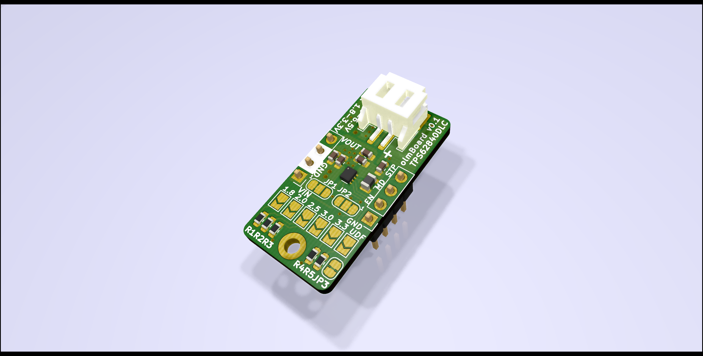
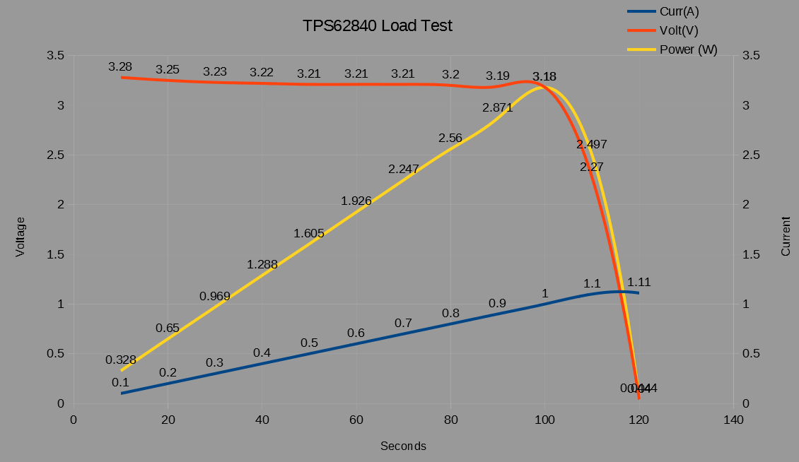
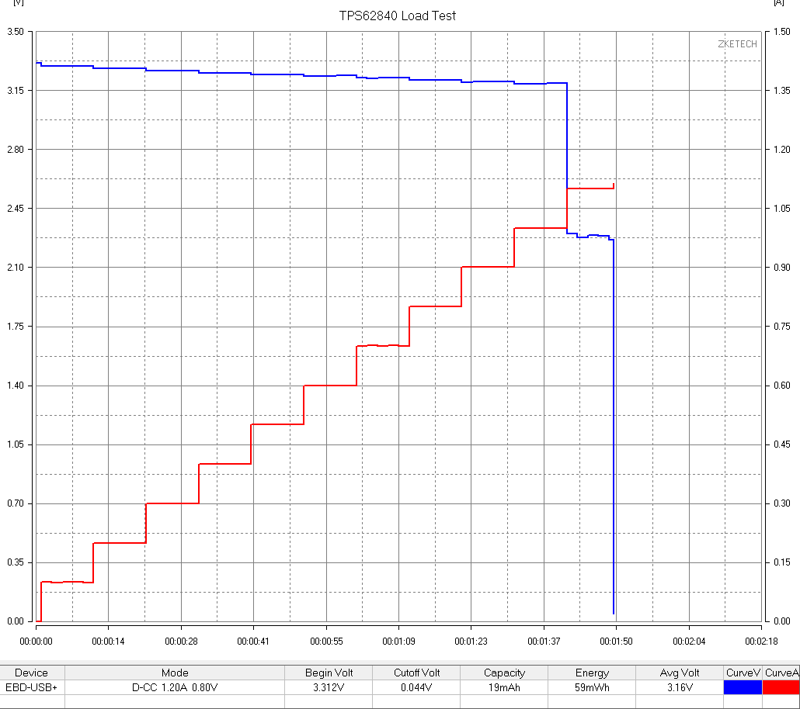

# olmBoard v0.1
This is a TPS62840 based, ultra-low quiescent current, highly-efficient, breadboard-friendly buck converter module w/:
- Selectable outputs (1.8-3.3 V)
- 60nA Iq, 150nA @ 100% mode
- 20nA shutdown current 
- 750mA max output current

Inital sweep load test results w/ 0.1A and 10 sec increments using EBD-USB load tester. The module works well up to 1A loads (short term), recommended max output current is 750mA. Voltage drop in the graph is due to the USB cable drop, actual voltage is stable around 3.3V up to 1A loads. 

